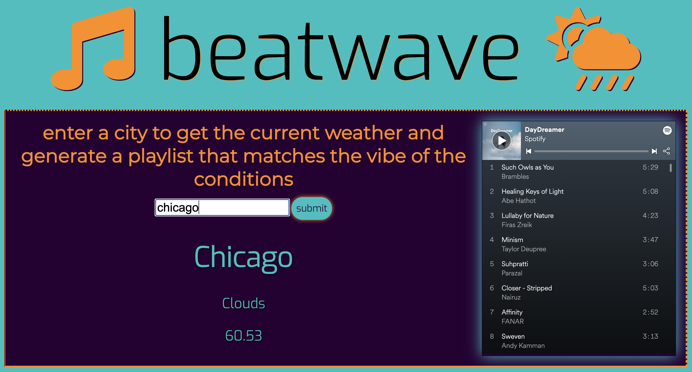

# beatwave

## Description

beatwave is a unique application that allows a user to generate a Spotify playlist based on the current weather in any city in the world.

This project is powered by the Spotify and OpenWeather APIs.

## Installation

When the user loads the page, they are presented with a playlist based on the current weather in Chicago, where this application was designed with love. The user can enter any city name in the search field, and beatwave will find a Spotify playlist inspired by its weather. The current weather conditions and temperature displays on the screen and a seven-day forecast is generated as well.

View our project as it is deployed via GitHub: https://group-proj-1.github.io/beatwave/

Clone the repo: https://github.com/group-proj-1/beatwave

### Contributors

Brandon Akers, Tiffany Deakin, Rondolph Dixon, and Valerie Michalecki

### Acknowledgments

We owe a huge thanks to Scott Brunswig, Katy Cooney, and Nicole Wilsey Starr for their guidance and support throughout the development process.

